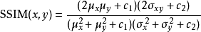
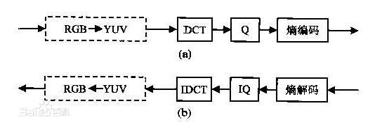
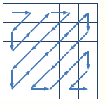
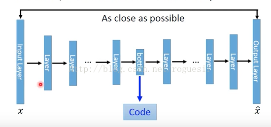
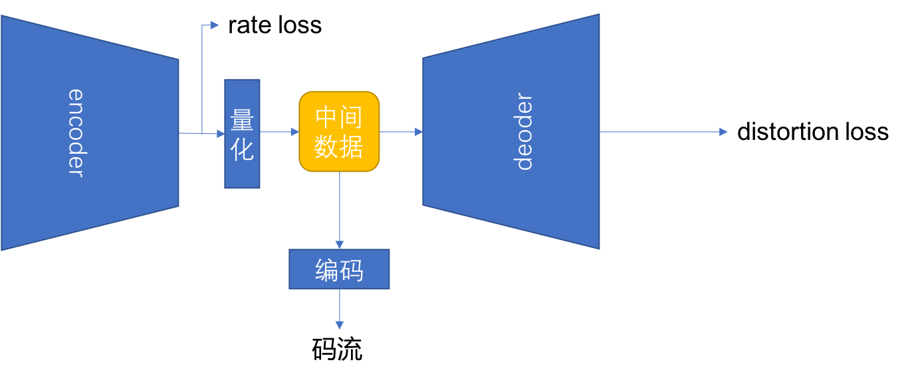
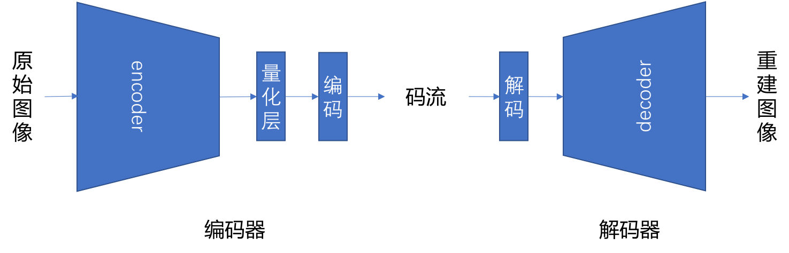

# 一、概述
图像存储在三维矩阵中，保存着图片在二维空间中各个像素位置的色彩、亮度等信息。常见的形式包括RGB(红绿蓝)、YUV(亮度、色度、？？)等，矩阵中的每个位置都由多个比特的整形数据表示，因此一张完整的未压缩图像数据量较大并且包含较多的冗余。互联网时代图片和视频占据了大量的存储空间，因此高效的图像压缩技术对于提高存储效率有非常重要的意义。
图像压缩主要包括 有损压缩 和 无损压缩 两种。  
无损压缩顾名思义，压缩后的数据可以完全解压为原始数据，不会造成任何的损失。其主要代表有PNG等。  
有损压缩在压缩过程中会带来一定的质量损失。其主要代表有JPEG、JPEG2000等。

### Metric
有损图像压缩过程中需要对图像失真的程度进行有效的度量，下面介绍集中常见的度量指标：  
#### PNSR(峰值信噪比)
计算公式 [9]：  
$$ PSNR=10*log10((2^n-1)^2/MSE) $$  
虽然峰值信噪比不能完全反映人类视觉效果，但是它仍是一个比较流行的量化指标。  
#### SSIM
[11] SSIM(structural similarity index)，结构相似性，是一种衡量两幅图像相似度的指标。该指标首先由德州大学奥斯丁分校的图像和视频工程实验室(Laboratory for Image and Video Engineering)在 [10] 中被提出。  
作为结构相似性理论的实现，结构相似度指数从图像组成的角度将结构信息定义为独立于亮度、对比度的，反映场景中物体结构的属性，并将失真建模为亮度、对比度和结构三个不同因素的组合。用均值作为亮度的估计，标准差作为对比度的估计，协方差作为结构相似程度的度量。  
计算公式如下：  
$$...$$  
  
#### MS-SSIM  
MS-SSIM是对SSIM的一种改进,MS这里是Multi-Scale的缩写。它 [4] 通过多个阶段的下采样，对多个尺度进行计算。许多实验[13,14]表明MS-SSIM对主观质量的度量上达到和SSIM类似甚至更好的效果。[12]
计算公式：

$$...$$

## 1.1 传统图像压缩算法：
### 1.1.1 JPEG
JPEG [1 & 2] 是Joint Photographic Experts Group（联合图像专家小组）的缩写，是第一个国际图像压缩标准。JPEG图像压缩算法能够在提供良好的压缩性能的同时，具有比较好的重建质量，被广泛应用于图像、视频处理领域。
JPEG静止图像压缩标准,中端和高端比特速率上的良好的速率畸变特性，但在低比特率范围内，将会出现很明显的方块效应，其质量变得不可接受。
  
以baseline JPEG算法(baseline sequential)压缩24位彩色图像为例,压缩步骤如下：  
#### (1). 颜色转换  
RGB -> YCbCr

#### (2). DC电平偏移  
作用？DCT变换的需求？DC电平偏移的目的是保证输入图像的采样有近似地集中在零附近的动态范围。

#### (3). 子采样  
由于人眼对Y通道的信息更加敏感，所以常常会对U和V通道的信息进行下采样以减少存储信息量。常见的子采样包括YUV420等

#### (4). DCT变换  
DCT（DiscreteCosineTransform）是将图像信号在频率域上进行变换，分离出高频和低频信息的处理过程，经过DCT变换后，图像的低频信息会往左上角集中。然后再对图像的高频部分（即图像细节）进行压缩，以达到压缩图像数据的目的。首先将图像划分为多个 8x8 的矩阵。然后对每一个矩阵作DCT变换。变换后得到一个频率系数矩阵，此时其中的频率系数都是浮点数。

#### (5). 量化
对于DCT之后的结果，根据以下的标准量化表进行量化。  

标准亮度量化表：

  
  

标准色度量化表：

  

#### (6). 编码  
编码采用两种机制：  
（1）0值的行程长度编码
（2）熵编码
1. zig-zag ordering  

  
 (https://www.cnblogs.com/tgycoder/p/4991663.html)

2. xxx

### 1.1.2 JPEG2000
JPEG 2000 [8] 是基于小波变换的图像压缩标准，由Joint Photographic Experts Group组织创建和维护。JPEG 2000通常被认为是替代JPEG的下一代图像压缩标准。优势：JPEG2000的压缩比更高，而且不会产生原先的基于离散余弦变换的JPEG标准产生的块状模糊瑕疵。JPEG2000同时支持有损压缩和无损压缩。另外，JPEG2000也支持更复杂的渐进式显示和下载。JPEG2000的失真主要是模糊失真。模糊失真产生的主要原因是在编码过程中高频量一定程度的衰减。传统的JPEG压缩也存在模糊失真的问题。就图像整体压缩性能来说，在低压缩比情形下（比如压缩比小于10：1），传统的JPEG图像质量有可能要比JPEG2000要好。JPEG2000在压缩比比较高的情形下，优势才开始明显。整体来说，和传统的JPEG相比，JPEG2000仍然有很大的技术优势，通常压缩性能大概可以提高20%以上。一般在压缩比达到100：1的情形下，采用JPEG压缩的图像已经严重失真并开始难以识别了，但JPEG2000的图像仍可识别。

## 基于学习的方法   
随着计算能力的发展，深度学习已经在计算机视觉等领域展现出强大的力量，使得通过对大量自然图片进行学习，获得其中的特征表达成为可能。近几年一些学者已经在这方面做出了非常优秀的成果。包括Google、WaveOne、ETH等。  
基于学习的方法的基本思想来源于autoencoder，这是一种将高维数据映射到低维空间，然后再还原到原始数据空间的结构，其基本结构如下图：  
  
JPEG对空间相关性的利用不够充分，为了充分利用空间相关性。基于学习的方法通过卷积神经网络[?]提取空间特征。
[3]中坐着通过LSTM等方法循环输出码流的方法 称为层进式编码(Pruduce Progessive Codes),这种方法能够随着码流的持续输出能够获得越来越好的图像恢复质量。其中典型的代表有google的两篇文章 [4],[5],[6]，其部分代码开源在[github](https://github.com/tensorflow/models/tree/master/research/compression)中。

### 1. 数据集准备  
在如今的互联网大数据时代，网络上可以搜集到的图片数据虽然很多，但是原始的无损图像数据非常有限。不过如果从信号恢复的角度来讲，任何格式的图像数据都可以作为无损数据来对网络进行训练。所以很多论文包括谷歌[5]的工作都是直接收集的大量网络图片来制作训练集。

### 2. 网络结构

### 3. 损失函数设计  
典型的损失函数包括L1、L2，以及VGG Loss，GAN loss

### 4. Rate Distortion Optimization

# 三、我们的工作  
## 3.1 结构
我们在上文提到的Autoencoder结构的基础上，对整个网络结构进行了如下改进
#### (1) 加入量化层
$$ ... $$
#### (2) 加入 rate loss
#### (3) 网络中使用中使用resnet和pixel shuffle结构

用于训练的整体网络结构如下：  
  

使用训练完成的模型对图像进行编解码：  

训练
1. 逐步增加的rloss  
At the begining of training \lamda was set to zero to make sure the network won't converge to local optimum. when the network with no rate constraint is convergent after enough epoches of training, we gradually add rate loss into the loss function, and we get a convergence curve as shown in Fig?
性能
1. CLIC2018

# 四、后续计划  
由于我们目前全图使用的是统一的压缩比例而没有考虑到图像信息量在不同区域的区别，所以下一步考虑在不同的区域使用不同的量化级别进行压缩，这方面也已经有了一些相关的工作包括google [6] 和 港科大[7].

# 参考文献
[1] https://en.wikipedia.org/wiki/JPEG  
[2] https://baike.baidu.com/item/JPEG  
[3] Learning to inpaint for Image Compression  
[4] Toderici, G., O'Malley, S. M., Hwang, S. J., Vincent, D., Minnen, D., Baluja, S., ... & Sukthankar, R. (2015). Variable rate image compression with recurrent neural networks. arXiv preprint arXiv:1511.06085.  
[5] Toderici, G., Vincent, D., Johnston, N., Hwang, S. J., Minnen, D., Shor, J., & Covell, M. (2017, July). Full resolution image compression with recurrent neural networks. In Computer Vision and Pattern Recognition (CVPR), 2017 IEEE Conference on (pp. 5435-5443). IEEE.  
[6] Johnston, N., Vincent, D., Minnen, D., Covell, M., Singh, S., Chinen, T., ... & Toderici, G. (2017). Improved lossy image compression with priming and spatially adaptive bit rates for recurrent networks. arXiv preprint arXiv:1703.10114.  
[7] Li, M., Zuo, W., Gu, S., Zhao, D., & Zhang, D. (2017). Learning convolutional networks for content-weighted image compression. arXiv preprint arXiv:1703.10553.  
[8] https://baike.baidu.com/item/JPEG%202000/8097196?fromtitle=jpeg2000&fromid=5452998  
[9] https://baike.baidu.com/item/psnr  
[10] Wang, Z., Bovik, A. C., Sheikh, H. R., & Simoncelli, E. P. (2004). Image quality assessment: from error visibility to structural similarity. IEEE transactions on image processing, 13(4), 600-612.  
[11] https://en.wikipedia.org/wiki/Structural_similarity  
[12] Wang, Z., Simoncelli, E. P., & Bovik, A. C. (2003, November). Multiscale structural similarity for image quality assessment. In Signals, Systems and Computers, 2004. Conference Record of the Thirty-Seventh Asilomar Conference on (Vol. 2, pp. 1398-1402). Ieee.  
[13] Søgaard, J., Krasula, L., Shahid, M., Temel, D., Brunnström, K., & Razaak, M. (2016). Applicability of Existing Objective Metrics of Perceptual Quality for Adaptive Video Streaming. Electronic Imaging, 2016(13), 1-7.  
[14] Dosselmann, R., & Yang, X. D. (2011). A comprehensive assessment of the structural similarity index. Signal, Image and Video Processing, 5(1), 81-91.
