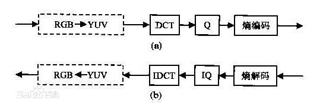

# 概述
## 传统图像压缩算法：
### JPEG
JPEG 是Joint Photographic Experts Group（联合图像专家小组）的缩写，是第一个国际图像压缩标准。JPEG图像压缩算法能够在提供良好的压缩性能的同时，具有比较好的重建质量，被广泛应用于图像、视频处理领域。
JPEG静止图像压缩标准,中端和高端比特速率上的良好的速率畸变特性，但在低比特率范围内，将会出现很明显的方块效应，其质量变得不可接受。

以baseline JPEG算法(baseline sequential)压缩24位彩色图像为例,压缩步骤如下：
1. 颜色转换 RGB -> YCbCr
2. DC电平便宜
3. 子采样 YUV420
4. DCT变换
DCT（DiscreteCosineTransform）是将图像信号在频率域上进行变换，分离出高频和低频信息的处理过程。然后再对图像的高频部分（即图像细节）进行压缩，以达到压缩图像数据的目的。首先将图像划分为多个8*8的矩阵。然后对每一个矩阵作DCT变换。变换后得到一个频率系数矩阵，其中的频率系数都是浮点数。
5. 量化

6. 编码

### JPEG2000
